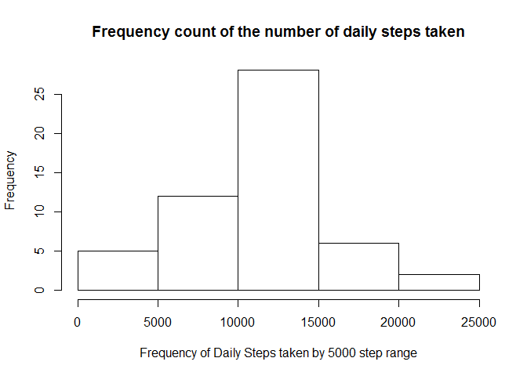
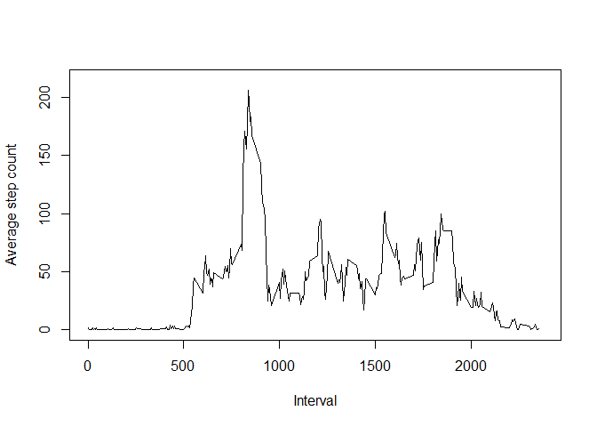
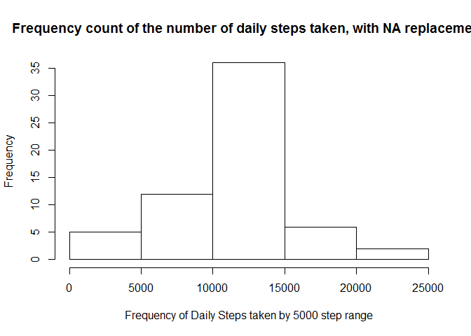
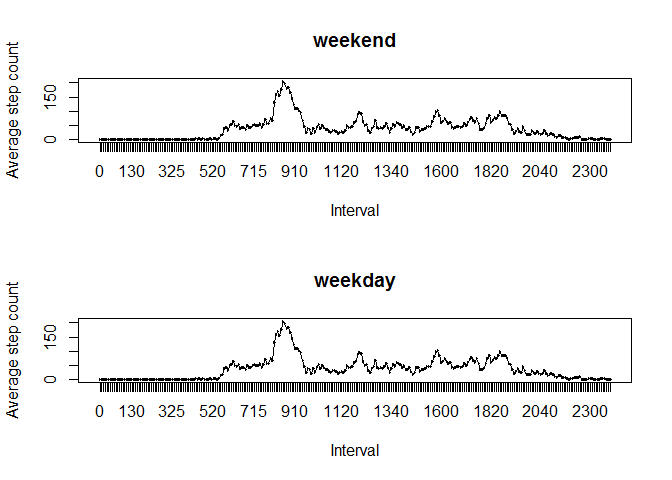

# Reproducible Research: Peer Assessment 1


```
## Loading required package: httpuv
## Loading required package: caTools
## Loading required package: ggplot2
```

## Loading and preprocessing the data


```r
pa1<-read.csv("C:/Users/mgyory/Documents/Assignments/Data Science Cert/Reproducible Research/Peer Assignment 1/activity.csv")
```

###Separate out NA data from remainder of data

###0 or positive steps are when the person is capable of taking steps, i.e. not sleeping


```r
pa1steps<-pa1[which(pa1$steps>=0),]
pa1na<-pa1[which(is.na(pa1$steps)),]
```

## What is mean total number of steps taken per day?

```r
pa1daystep<-aggregate(x=pa1steps$steps,by=list(pa1steps$date),FUN="sum")

hist(x=pa1daystep$x, main="Frequency count of the number of daily steps taken", xlab="Frequency of Daily Steps taken by 5000 step range")
```

 

```r
options(scipen=999, digits=2)
stepmean<-mean(pa1daystep$x)

stepmed<-median(pa1daystep$x)
```
The mean number of steps taken is 10766.19 per day.
The median number of steps taken is 10765 per day.

###Find the step interval with the max value

```r
pa1intavg<-aggregate(x=pa1steps$steps,by=list(pa1steps$interval),FUN="mean")

stepinmax<-max(pa1intavg$x)

options(scipen=999,digits=2)
maxinterval<-pa1intavg[which(pa1intavg$x==stepinmax),]
```
The step interval with the maximum value of 206.17 is the 835 interval.

## What is the average daily activity pattern?

```r
plot(x=pa1intavg$Group.1,y=pa1intavg$x, type="l", xlab="Interval",ylab="Average step count", xlim=c(0,2375), ylim=c(0,215))
```

 

## Imputing missing values

There are 2304 number of rows with missing data.

###Impute mean values for missing Step data interval

```r
colnames(pa1intavg)<-c("interval","steps")

pa1nareplace<-pa1na

pa1naimpute<-merge(pa1nareplace,pa1intavg,by=c("interval"))
colnames(pa1naimpute)<-c("interval","drop","date","steps")

pa1nafin<-pa1naimpute[,!(names(pa1naimpute) %in% c("drop"))]
```

###Combine replaced missing values data frame with non-missing data value data frames


```r
pa1new<-rbind(pa1steps,pa1nafin)

pa1newday<-aggregate(x=pa1new$steps,by=list(pa1new$date),FUN="sum")

hist(x=pa1newday$x, main="Frequency count of the number of daily steps taken, with NA replacement", xlab="Frequency of Daily Steps taken by 5000 step range")
```

 

```r
hist(x=pa1daystep$x, main="Frequency count of the number of daily steps taken", xlab="Frequency of Daily Steps taken by 5000 step range")
```

 

```r
newmean<-mean(pa1newday$x)

newmed<-median(pa1newday$x)
```

The original mean was 10766.19 steps. The mean with replacement of missing values is 10766.19 steps.

The original median was 10765 steps. The median with replace of missing values is 10766.19 steps. 

## Are there differences in activity patterns between weekdays and weekends?


```r
pa1weekends<-cbind(pa1nafin,dow=weekdays(as.Date(pa1nafin$date,format="%Y-%m-%d")),weekend=(weekdays(as.Date(pa1nafin$date,format="%Y-%m-%d")) =="Saturday" | weekdays(as.Date(pa1nafin$date,format="%Y-%m-%d")) =="Sunday"))

pa1weekends<-cbind(pa1weekends,weekfac=factor(pa1weekends$weekend, labels = c("weekday","weekend")))

intfac<-factor(pa1weekends$interval)

pa1wkavg<-aggregate(x=pa1weekends$steps,by=list(intfac,pa1weekends$weekfac),FUN="mean")
```

###Create a plot showing average steps during each interval divided between weekdays and weekends

```r
par(mfrow=c(2,1))
plot(x=pa1wkavg$Group.1[pa1wkavg$Group.2=="weekend"],y=pa1wkavg$x[pa1wkavg$Group.2=="weekend"], type="l", xlab="Interval",ylab="Average step count", main="weekend")
lines(x=pa1wkavg$Group.1[pa1wkavg$Group.2=="weekend"],y=pa1wkavg$x[pa1wkavg$Group.2=="weekend"], type="l")
plot(x=pa1wkavg$Group.1[pa1wkavg$Group.2=="weekday"],y=pa1wkavg$x[pa1wkavg$Group.2=="weekday"], type="l", xlab="Interval",ylab="Average step count", main="weekday")
lines(x=pa1wkavg$Group.1[pa1wkavg$Group.2=="weekday"],y=pa1wkavg$x[pa1wkavg$Group.2=="weekday"], type="l")
```

 
